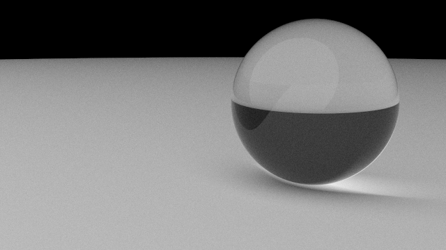
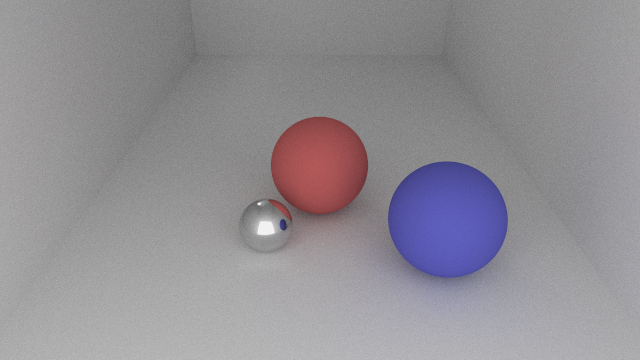

# path-tracing
A basic (toy) 3D image renderer based on a Monte Carlo method called [path tracing](https://en.wikipedia.org/wiki/Path_tracing). The basic steps of the method are
1. Cast a primary ray into the scene for a given pixel
2. When an intersection is found, record the color, position, and angle of incidence.
3. From this intersection position, cast a new ray in a random direction (except for specular surfaces)
4. Perform steps 2 and 3 for a given ray depth and then aggregate the results to color the pixel

This method is unbiased and is therefore very inefficient, since only rays that eventually intersect a light 
source return a non-zero color. Though if you're willing to trace enough rays (and wait a few minutes) the results
are fairly realistic.

# Compiling
The project uses CMake, so to compile it create a build directory,
```bash
mkdir build
```
enter the directory and configure,
```bash
cd build
cmake ..
```
then run
```bash
make
```
that creates the executable path-tracing.out.

# Usage
Currently src/main.cc contains the scene description, so you must recompile for each new scene. 
The following code produces an image of a glass sphere placed on a surface:
```c++
int main() {
  const int width = 640;
  const int height = 360;
  const int samples = 1000;
  const int max_depth = 5;
  
  std::vector<Sphere> world = {
    // Floor
    Sphere(Vector3D(0, 0, -2000), 2000, diffuse, White),
    
    // Glass sphere
    Sphere(Vector3D(2.2, -3, 2), 2, glass, White),

    // Light
    Sphere(Vector3D(-100, -100, 100), 150, light, White),
  };

  // Camera position, target (where it is pointing), and orientation (up).
  Vector3D pos(0, -20, 4);
  Vector3D tar(0, 0, 1);
  Vector3D up(0, 0, 1);
  double fov = 20; // field of view
  double aspect = double(width) / height;
  Camera camera(pos, tar, up, fov, aspect);

  std::vector<Color> colors = trace_scene(world, camera, width, height, samples, max_depth);
  
  Image img(height, width, colors);
  img.write("image.ppm");
}
```
produces:


Another example shows colors and specular reflections:


# TODO
* Add more shapes. Currently the tracer only has the shape Sphere, though even walls can be represented by a large radius sphere.
* Currently sphere intersections are tested linearly on each object in the scene. Implement bounding boxes and place objects in a tree.
* Add a scene description file and parsing
